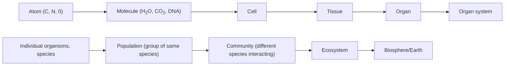

# Study of Life Part 1
## Theory
- come up with some question
- decide on test-able answer to the question (`hypothesis`)
    - this hypothesis isn't some nonsense answer but rather it's based on some facts or common underlying assumptions
    - usually a hypothesis is followed by a prediction of what will happen when tested and a justification
- design an expirement
- run it and collect data
- compare to hypothesis
- the above steps are the `scientific method`
- hypotheses are combined into theories which aim to explain things supported by experiments

## Video Questions
- What was the scientific question both men were attempting to answer?
    - where do species come from
- What became their hypotheses as they observed their specimens?
    - species changed into new species
- What natural laws and facts were their hypotheses based on?
    - ...
    - ...
- Table 1 below lists several pieces of data collected by Darwin, Wallace, or both of them. Mark an X in the Darwin column if he made the observation or in the Wallace column if he made the observation. If both men made the same observation, mark an X in both columns.

| Observation | Darwin | Wallice |
|---|---|---|
|Fossils of extinct animals turn up where similar animals live today| x | |
|You can tell which island a Galápagos tortoise comes from by the shape of its shell| x | |
|Each Galápagos island has a different kind of mockingbird| x | |
|Islands that are near each other have similar but distinct animals living on them| x | |
|Birdwing butterflies are found throughout the Malay Archipelago, but species differ slightly from island to island| | x |
|Animals have distinct geographic ranges, but more-similar species tend to live closer to each other| | x |
|Some species possess vestigial structures, such as finger bones in the flippers of manatees and similar bones in whale flippers| | x |
|Animals living on islands in the eastern part of the Malay Archipelago are similar to Australian fauna, while animals on western islands are similar to Asian fauna| | x |
|Individuals within a given species vary in small ways| x | x |
|Animal populations are kept in check because a massive number of young animals die in every generation| x | x |

- Provide an explanation for why this is referred to as the theory of evolution not the hypothesis of evolution.
    - ...

## 5 Main Characteristics of Life
- `life is ordered`: things don't just happen, the simplest unit of life a cell is enormously complex and ordered
- `life can "work"`: living organism take energy from the environment to maintain metabolic processes for survival
- `life grows and develops`: living organisms can repair themselves when injured
- `life can reproduce`: self explanitory
- `life can adapt and respond`: things respond to stimuli. Given enough of a stimuli some adaptation say fur or an extra lim is created. Adaptations can be more subtle like moving to a more habitable area

## Lecture Notes
### Life Works
- 3 kinds of organisms
    - `producers`: thinks plants. they use sunlight into usable food energy
    - `consumers`: they eat other organisms to turn that to energy
    - `decomposers`: fungi, bacteria, worms. Break down dead organisms
- nutrients are recycled. they flow between organism types not through
- energy is the capactity to do work

### Growth and Development
- get bigger (cell division)
- build and repair

### Reproduction
- having offspring
- passing down DNA to inherit features
- asexual vs sexual

### Respond to Stimuli

### Adaptation and Evolution
- change over time via natural selection

### Taxonomy
- the study of classifying organisms

### Misc
- tree of ilfe contains
    - animals
    - fungi
    - plants
    - protists
    - monera
- monera (bacteria) don't have a nucleus. their dna floats around freely
- prokaryote means has nucleus. eukaryote means doesn't have nucleus

- whittaker's 5 kingdoms

|Name|Nucleus|Num Cell|
|---|---|---|
|Monera|Pro|Single|
|Protista|Euk|Single|
|Fungi|Euk|Both|
|Plantae|Euk|Multi|
|Animalia|Euk|Multi|

- Woese's 3 domains
    - bacteria: no nucleus, small
    - archaea: no nucleus, small
    - eukarya: nuclues + quite alot bigger

# Study of Life Part 2
## Biological Hierarchy

- `emergent property`: as life becomes more complex new feature arise
    - ex: stability from atom to molecule

## Tissues
- ex: muscle, connective-bone, nerve, connective-blood, conective-adipose, epithelial

## Organs/systems
- systems: circulatory, respiratory, digestive, reproductive, immune, urinary, integumentm skeletal, muscular, nervous, and endocrine

## Cell Life Cycle
- `G0`: does nothing. gets a signal from the environment to prepare for cell division
- `G1`: growth phase 1. cell gets bigger
- `S phase`: replicates DNA (DNA synthesis)
- `G2`: growth phase 2. gets a bit bigger and make more cell parts
- `mitosis/m phase`: cell division
- g0, g1, s phase, and g2 are collectively called `interphase`

## Cell Division
- how living things grow and repair themselves
- prokaryotes preform binary fissio
- eukaryotes preform mitosis
- chromatin: loose and unorganized DNA
- chromosomes: condensed and organized versions of DNA
- spindle fibers: proteins inside the cell that seprate the DNA
- nucleus: membrane surrounding the DNA
- diploid: 2 versions of each piece of DNA

### Mitosis
- `Prophase`
    - nucleus breaks down
    - chromatin condenses into chromosomes
    - spindle fibers begin to form
- `Metaphase`
    - spindle fibers attach and pull chromosomes to middle
- `Anaphase`
    - spindle fibers pulled appart the chromosomes and pull to poles of the cell
- `Telophase`
    - cell starts indenting in the middle
    - reform the nucleus
    - chromosomes relax into chromatin
- at the end (not part of mitosis) happens `cytokenesis`
    - cell divides