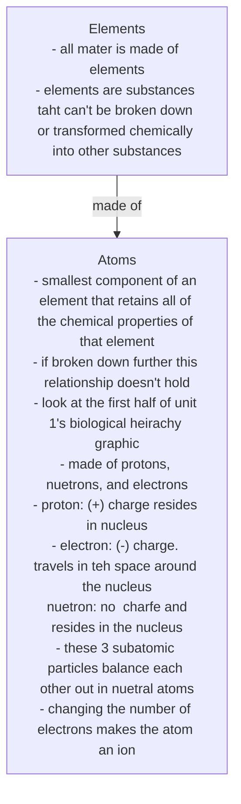
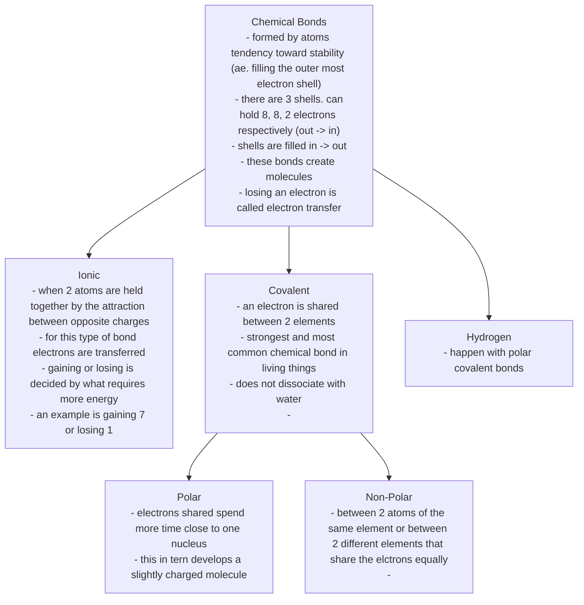

<!-- each box is a key topic, bullets are notes about the topic. you may draw connections between topics. Think summarizing -->
## Cell Chemistry Part 1

### Accompanying Questions
- What are the 3 components of an atom? Including their charges and masses.
    - proton: positive charge. 1 mass
    - nuetron: no charge. 1 mass
    - electron: negative charge. negligible mass
- If an atom has 6 protons, how many electrons will it have?
    - 6
- If an atom has an overall negative 2 charge, what has happened to this atom?
    - it gained 2 electrons
- If an atom has an overall positive 1 charge, what has happened to this atom?
    - it lost an electron

- i think im wrong about ionic electron transfer

### Chemical Reactions
- the process of breaking bonds are forming new ones
- `reactants`: substances that go into a chemical reaction
- `products`: substances produced at the end of a chemical reaction
- 2 types of chemical reactions*
    - `catabolic`: molecules broken down into smaller pieces
    - `anabolic`: molecules are built up into larger pieces

## Biomolecules
- the large molecules necessary for life (carbs, liqids, protiens, and nucleic acids)
- contains CHNOPS elements
- `monomer`: repeated segments. typically seen in the biomolecules
- biomolecules are considered `polymers` or a chain on monomers

### Carbs
- provide energy particularly through glucose
- 3 types
    - `monosaccharides`: simple sugars
    - `disacchrides`: form when 2 monosaccharides unergo a chemical reaction
    - `polysaccharides`: long chaiun of monosaccharides linked via covalent bonds

### Lipids
- hydrophobic/insoluable in water because nonpolar
- used as storage for long term energy (fat). also building block of some hormones and used as part of the plasma membrane
- fat (triglycerides) consist of glycerol and fatty acids of which there are 2 kinds
    - `saturated`: single bonds in the chain. saturated with hydrogen. packed tightly ans solid at room tempature
    - `unsaturated`: double bonds. the extra bonds cause a kink which keep them from packing tightly and they're threfore liquid at room temperature. thinks oils.
- essential fatty acids are required by the body but not made by it (omega 3)
- `phospholipids`: major part of plasma membrane. both hydrophobic and hydrophillic regions.

### Protein
- abundant molecule in living things
- do alot of stuff
- can be structural, regulatory, contractile, or protective
- can be used in transport, storage, or membranes
- also toxins and enzymes
- considered polymers of amino acids
- `enzymes`: catalysts in biochemical reactions. enzymes are not a one size fit all. a lock with a single key where the substrate (rectant that binds) is the key.
- `hormones`: chemical signaling molecules. control physiological processes
- `amino-acids`: monomers that make up proteins
- consists of a central carbon bonded to an amino group, a carboxyl group, and a hydrogen atom
- also has another atom/group of atoms bonded to the central carbon called the R-group
- this R group is the only difference between amino acids
- the order and number of amino acids determine shape, size, and function
- they are atached by a covalent bond known as a peptide bond
- 4 levels of protein structure
    - `primary`: the unique sequence and number of amino acids in a polypeptide chain
    - `secondary`: pleats formed by hrydrogen bonding between atoms on the backbone of polypeptide chain. R groups are attached to carbons and extend above and below the fold of the pleat. the pleated segments align parallel to each other and hydrogeen bonds form between the same pairs of atoms on each of the aligned amino acids. that alpha helix and beta pleated sheet structires are found in many globular and fibrous proteins
    - `tertiary`: the unique 3D structure of the polypeptide. Caused by chemical interactions between amoni acids and regions of the polypeptide. May be ionic bonds between r groups on different amino acids or hydrogen bonding beyond that involved in secondary structure.

### Nucleic Acids
- key macromolecule
- carry genetic blueprint of a cell and instructions for the function of the cell
- 2 main types
    - `DNA`: genetic material found in all living organisms. never leave the nucleus. use RNA to communicate with the rest of the cell.
    - `RNA`: mostly involved in protein synthesis
- both made of monomers called nucleotides
- `nucleotide`: made of nitrogenous base, pentose carbon sugar, and a phosphate group

### Enzymes
- made of proteins and speed up chemical reactions in a cell
- have pocket called active site (where the substrate goes)

## Cell Chemistry Part 2
