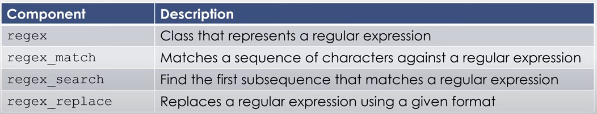
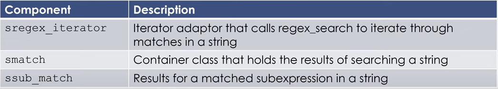
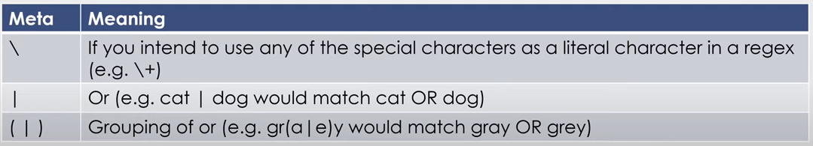
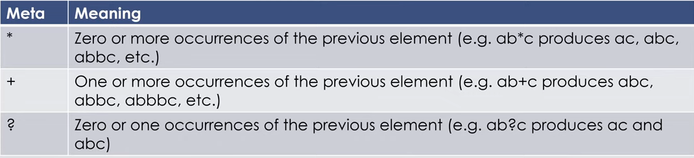
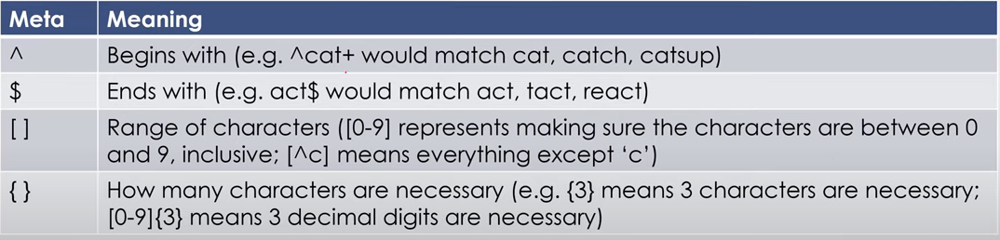
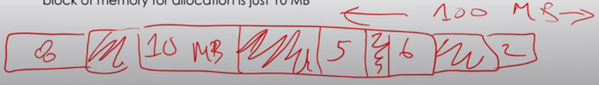

# Regular Expressions
## What is
- a sequence of characters that define a search pattern
- can use in terminal. <- not really relevant but useful for me
- The most important thing is just to test your regex

## How to use
- import `regex`




- **NOTE**: the syntaxtical correctness of a regular expression is tested at RUNTIME

## Metachacter
- any character that has special meaning





Ex: Backslash (ae. escape character)
```cpp
#include <regex>

// use of \ (ae. escape cahracter)
string str1 = "A string that has the pipe symbol: |";
regex pattern("\|");

bool match = regex_search(str, e);
cout << (match ? "Matched" : "Not matched") << endl 
>>>
Matched
```

Ex: Pipe (ae. or)
```cpp
string str1 = "Allan";
regex pattern("Laiba|Allan");

// Would match
// Allan
// Laiba

bool match = regex_search(str, e);
cout << (match ? "Matched" : "Not matched") << endl 
>>>
Matched
```

Ex: Parenthesis (ae. grouping)
```cpp
string str1 = "Jeffrey";

// Would match any of these:
// Geoffrey
// Jeffrey
// Geoffery
// Jeffery

regex pattern("(Geo|Je)ff(re|er)y");

bool match = regex_search(str, e);
cout << (match ? "Matched" : "Not matched") << endl 
>>>
Matched
```

Ex: Star (ae. 0 or more)
```cpp
// doesn't need to contain b but can
string str1 = "ac";

// Would match:
// ac
// abc
// abbbc
// abbbbbbbbbbbbbbbbbbbbbbbbbbbbbbbbbbbbbbbbbbbbbbbbbbbbbbc

regex pattern("ab*c");

bool match = regex_search(str, e);
cout << (match ? "Matched" : "Not matched") << endl 
>>>
Matched
```

Ex: + (ae. one or more)
```cpp
```

Ex: ? (ae. optional)
```cpp
```

Ex: ^ (ae. begins with)
```cpp
```

Ex: $ (ae. ends with)
```cpp
```

Ex: [] (ae. range)
```cpp
```

Ex: {} (ae. length of match)
```cpp
```

# Dynamic Memory Allocators
## Problems
- coupling allocation and construction can be wasteful

Ex:
```cpp
string *const p = new string[n];
string s;
string *q = p;
while (cin >> s && q != p +n){
    *q++ = s;
}
const size_t size = q - p;
delete[] p;
```   
-
    - `string *const p = new string[n]` <- this line makes n strings. What if, in the end we don't need n string instead we need less? We've wasted memory
    - Since initializing a string set it to empty string but right after we write to it (`*q++ = s`)
    - more importantly classes without default constructors can't be dynamically allocated as an array

## Fragmentation
- when memory is unusable even though it's theoretically available
- let's say you need 100 mb of memory and your system checks, there is infact 100mb total. If it's not all in a single block of memory then you can use it.



### Internal
- if the payload is smaller than the block size
- **Causes**:
    - overhead of maintaning heap data structure
    - padding for alignment purposes
    - explicit policy decisions

### External
- the above image. There is enough total memory, but no single free block is large enough

## Solution
### Allocators
- provide a source of memory for a given type
- once it's no longer needed it gives a place to return that memory
- allows generic containers to decouple memory management from the data itself

#### Allocator Requirements
- a class X allocating memory for an object T must be able to provide the following
    - X::pointer
    - X::const_pointer
    - X::reference
    - X::const_reference
    - X::value_type
    - X::size_type (unsigned, represents largest size you can allocate for an object)
    - X::difference_type (represents the defference between any two pointers)

### Where Used?
- STL Containers
- The string class

#### Basic Methods
- `allocate`: requires an int as param. acquire space for n objects of type T
- `deallocate`

comback to 1, a,b
3
