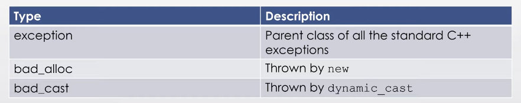
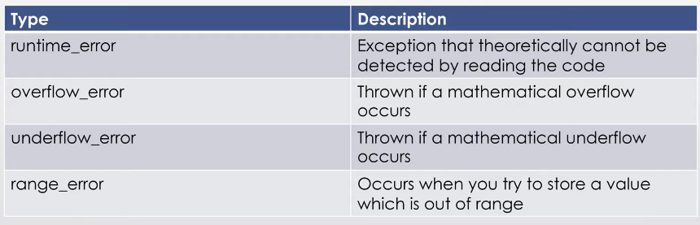
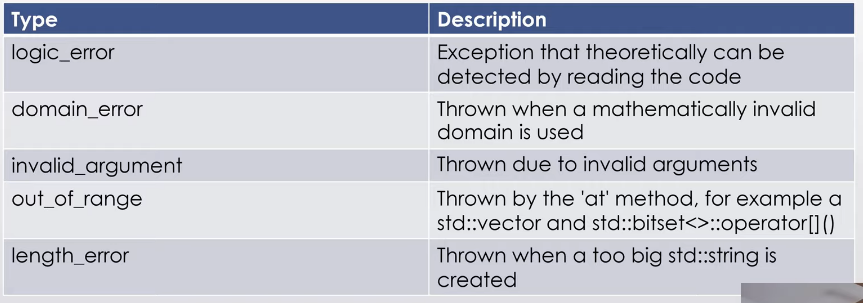

# Inheritance
## Basics
- a way to form new classes using classes that have already been defined

Example:
```cpp
class Robot{ // parent class
    public: 
        void setX(int n_x);
        void setY(int n_y);
        int getX();
        int getY();
    private:
        int x, y;
}

class ShieldedRobot: public Robot{ // child class
    public:
        void setShiled(int n_shield);
        int getShiedl();
    private:
        int shield;
}
```

Here, ShieldedRobot inherits from Robot. That means that shielded robot has all methods and attributes of a Robot and some new ones specific to the shielded robot class.

- private methods and attributes from the base class can't be accessed in the child class. To do so make the methods/attributes `protected` instead of private. This still keep these methods/attributes from being used elsewhere in the program. **Note** it is frowned upon to make member variables non-private. Instead just make setters and getters (look up encapsulation)

## Specialization/overriding
- if a method exists in the parent class and you would like to change the functionality, make both implementations virtual. Technically only required in the base class but good for clarity in both

```cpp
class A{
    virtual void foo(){
        // some code here
    }
}

class B: public A{
    virtual void foo(){
        // different code here
    }
}
```

- try to keep use of virtual to a minimum
- to use the base class' implementation do: `BaseClass::method()`
- **ALWAYS** use the virtual keyword in the destructor of the parent and child classes for clairity

## Super
- ae. passing values to base class constructor. just use initializer list

```cpp
class A{
    A(int x){
        // code here
    }
}

class B{
    B(int y): A(y){
        // diff code here
    }
}
```

# Polymorphism
## Pointers
- if a function expects a `reference/pointer` to a base class, you can pass both base and derived classes into it

Example:
```cpp
class A{
    // code here
}

class B: public A{
    // code here
}

void foo(A& ref){
    // code that uses the base class interface
}

void bar(A* ptr){
    // code that uses the base class interface
}

int main(){
    A p;
    B q;
    foo(p);
    foo(q);
    bar(&p);
    bar(&q);
    return 0;
}

```
- important to pass by reference or pointer to avoid chopping
- you can use a parent class pointer to point to a child object this is called `upcasting`

```cpp
class A{};
class B: public A{};

int main(){
    B x;
    A* y = &x;
    // code that uses parent class interface
    return 0;
}
```
- you can't have a child pointer point to a parent object (ae. `downcasting`)

## Virtual functions
- always make sure to use `virtual destructors` when using inheritance/polymorphism
- if both destructors are virtual it correctly de-allocates derived -> base
- `pure virtual functions`: in a parent class, if you are defining common functions but not implementing them set them to 0. also called abstract functions.
```cpp
class ABC(){
    virtual void foo() = 0;
    // as oppossed to virtual void foo(){return 0;}
}
```
- a pure virtual function can never be called. not overloading a pure virtual function will throw error
- having at-least one pure virtual function makes it an ABC. ABC's can't be instantiated
- can still use ABC's for polymorphic functions (a. ABC pointers are fine, ABC vars aren't)

## New Keywords
- `override`: tells the complier that you're overriding a parent class method and guarantees same function signature. Useful to ensure your override is called (if you mess up the function signature you may accidentally call the parent's version)
```cpp
class A{
    int foo() const{
        // code
    }
}

class B: public A{
    int foo() const override{
        // code here
    }
}
```
- `final`: makes it so that method can no longer be overridden or so that class can't be inherited from. comes after the override keyword
- also a final class can't be an ABC


## Multiple Inheritance
- deriving from more than one base class
```cpp
class A{};
class B{};
class C: public A, B{};
```
- have both sets of methods and attributes
- constructors run in declaration order
- **Diamond Problem**: if the parents of a child share a parent, when accessing an attribute or method with a shared name, it becomes ambiguous
- can dis-ambiguate like so: `obj.PARENT::method()/attribute`
- Another **problem**: if you up-cast a parent pointer from a child object, and you try to access methods/attributes from the other parent this throws an error even though it does exist (can fix with dynamic_cast)

## Virtual Inheritance
- a solution to the above problem is `virtual inheritance`
- this removes the ambiguity of the base sub-object but complicates construction
- the 2 parents virtually inherit from their shared parent
```cpp
class A{};
class B: public virtual A{};
class C: public virtual A{};
class D: public B, C{};
```

## RTTI
- run-time type information: allows the type of an object to be determined during program execution
- only available for a class with at-least one virtual function
- there is a `typeid(obj)` operator that returns a reference to a `type_info` object. Use the `name` method to get a string that represents the type
## Casting
- `static_cast<>`: can cast up and down but it's not checked. Explicit up-cast is poor style as it's always valid. Above is an example of up-casting
- down-casting with static_cast is undefined  if the base pointer does not actually point to a derived object
```cpp
Derived* p = statc_cast<Derived*>(base_ptr);
```
- `dynamic_cast`: can cast up, down, and cross. Again explicit up-casting is redundant. Down-casting can be checked for validity
```cpp
Derived* p = dynamic_cast<Derived*>(base_ptr);
if (p) // casting worked
else // casting failed, p doesn't point to Derived
```
- cross-casting checks if an object in one hierarchy is also in another
```cpp
Base1* b1_ptr = &obj;
Base2* b2_ptr = dynamic_cast<Base2 *>(b1_ptr);
if (b2_ptr) // b2 shares a parent with b1
else // they aren't part of the same family tree
```

# Exception Handling
## Basics
- try, catch, throw
- you can throw anything, the type thrown will be important for catching
- catch can have an ellipsis (means catch all), a specific exception, a type, or a type and parameter (if you would like to use the exception in the catch block)
- `rethrowing` means after catching an exception throwing another one. useful if you want other code to handle he exception. exception is propagated outward
    - can also rethrow without parameter by just using the throw keyword. It will throw the same error instead of one of your choosing
- **NOTE**: if throwing a string literal, catch a `const char*`
- want to import the `exception` module
- **IMPORTANT**: need to catch exception by reference
- the what function will output the string we passed into it and construction time

Here's a list of exceptions




Inheriting from an error class is simple:
```cpp
class CustomError: public built_in_error{
    public:
        CustomError(string s): built_in_error(s){ // coudl have other param if custom error needs is
            // other constructor stuff
        }
}
```

## Exception Safety
- `No-throw`: called failure transparency. Operations are guaranteed to succeed. If there's an exception, it's handled behind closed doors
    - `noexcept`: keyword that goes before final, override, =0. Give no-throw guarantee to any function. Optimizers don't need to keep the stack in an unwindable state and objects aren't necessarily destroyed in inverse constructed order
    - use if confident function won't throw and/or we don't know what we'd do tp handle the error anyway
- `Strong`: called commit/rollback semantics. If an operation fails, all data will retain original values
- `Basic`: called no leak guarantee. No memory leaks and data will contain valid values; however, values may be different than what they were before
- `No exception safety`: nothing

# Smart Pointers

# Move Semantics