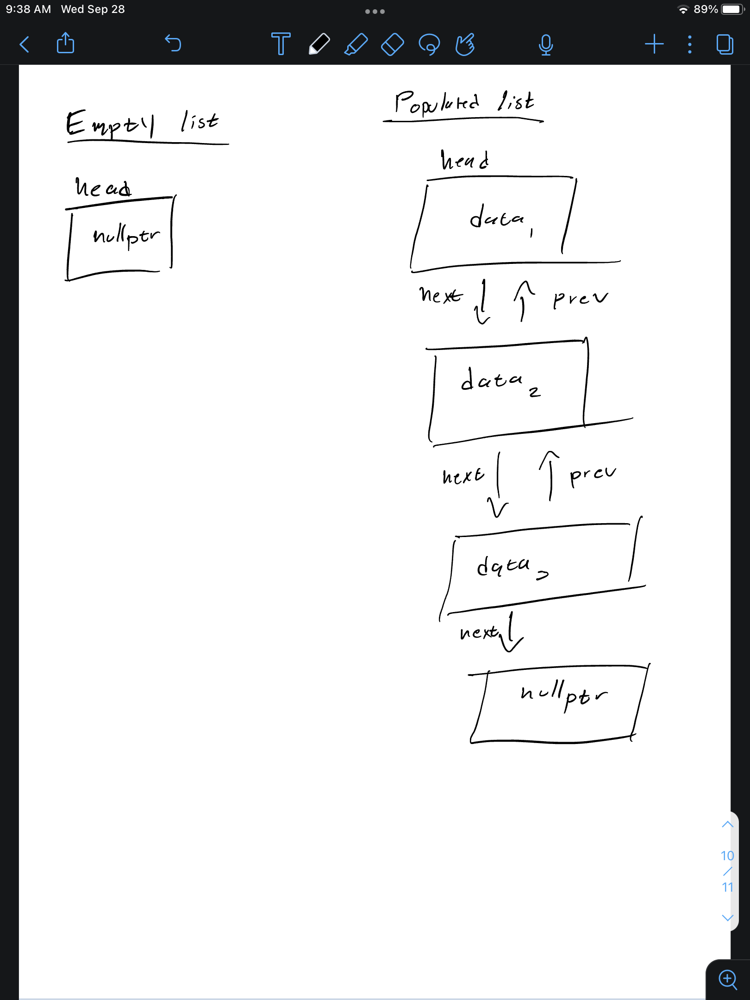

# Design Implementation
- I chose the doubly linked list because it was the simplest extra credit option
- It is not circular
- my nodes have 5 attributes
    - `val`: of type GuestType
    - `first_name`: a string
    - `last_name`: a string
    - `prev`: a pointer to the previous node. default sets to nullptr
    - `next`: a pointer to the next node. default sets to nullptr



# Notable Obstacles
- this project was pretty simple so the obstacles stemmed from my misunderstanding
- the only obstacle I can think of is my invite guest implementation. When I first made it I did not check for equality for all nodes other than the head and this made it so a node was always added. The solution was to just include that condition in the while loop

# Pseudocode
- `inviteGuest`:
```
# when i say values it short-hand for fname and lname
if the head is empty 
    return true 
else if the values given are the same as the head
    return false
# Because I need a previous node for my general implementation
else if the last name comes before the heads last name or the last names are the same but the first name come before the head first name
    create a node
    link it
    make head point to that node
    return true.
otherwise
    keep a pointer the the previous and current node for the loop
    while not at the end of the list
        if the values given are the same as the values of current
            return false
        else if the last name comes before the current last name or the last names are the same but the first name come before the current first name
            create a new node
            link it
            properly link the node before and after it
            return true
        increment the pointer for the loop
    if, at the end of the loop the node wasn't added
        create a new node
        link it
        make said node the new tail
        return true
    return false
```

- `crossGuestOff`:
```
if head is null
    return false
else if head's values match
    create a new node
    have it point to the rest of the list minus the head
    delete the head
    make head point to the new node
    return true
othwerwise
    until i get to the end of the list
        if the current node matches the values
            re-link the list so current is ommitted
            delete current
            return true
    return false
```

- `joinGuests`:
```
clean any dunamically allocated memory from odJoined
until the end of odOne
    get the values from it's nodes
    if name is unique to odOne
        add it to odJoined
    else if the full values are in both lists
        add it to odJoined
    otherwise
        return false
    repeat the above steps for odTwo
```

- `attestGuests`:
```
clean any dynamically allocated memory from odResult
if im supposed to match everything
    simply use the copy constructor
else if I should a specific person
    if the person exists in odOne
        add the person to odResult
else if only matching the first name
    loop throught the list and add any Guest who's forst anme matches
otherwise im matching the last name
    so do the same as above but for last name
```

# Test Cases
- **NOTE**, anytime there was a print, this was a visual test. If i was too lazy to implement an actual test I would print to see if the output was what I expected
```cpp
#include "WeddingGuest.h"
#include <string>
#include <cassert>
#include <iostream>
using namespace std;

int main(){
    WeddingGuest list;
    // list.print(); // should print nothing
    GuestType fname, lname, data;
    // cout << "--------" << endl;
    assert(list.verifyGuestOnTheList(10, fname, lname, data) == false); // checks that verifying on an empty list returns false
    assert(list.matchInvitedGuest("a", "b", data) == false); // checks that match return false on an empty list
    assert(list.invitedToTheWedding("A", "B") == false); // check that checking for people in an empty list returns false
    assert(list.crossGuestOff("A", "B") == false); // checks that crossing off a guest from an empty list does nothing
    assert(list.alterGuest("A", "B", "C") == false); // checks that you can't alter an empty list
    assert(list.noGuests() == true); // checks that noGuest correctly knows the list is empty
    assert(list.guestCount() == 0); // checks both that count works for an empty list and that the default constructor sets head to nullptr
    list.inviteGuest("Allan", "Gongora", "20");
    assert(list.alterGuest("Allan", "Gongora", "21")); // checks that you can alter a a guest when it exists in the list
    assert(list.alterGuest("X", "Y", "29") == false); // checks that you cant alter a guest that doesn't exist in a populated list
    assert(list.noGuests() == false); // checks that noGuest correctly knows the list is NOT empty
    assert(list.guestCount() == 1); // checks that I properly insert to an empty list
    list.inviteGuest("A", "Z", "19");
    list.inviteGuest("Aa", "Gongora", "25");
    // list.print();
    // cout << "--------" << endl;
    assert(list.inviteOrAlter("Person", "Last", "30") == true); // checks that returns true (redundant)
    assert(list.guestCount() == 4); // checks that count increased when inv/alter an guest that's not on the list
    assert(list.crossGuestOff("Aa", "Gongora") == true);// checks that crossing off an existing person can happen
    // list.print();
    // cout << "--------\n";
    assert(list.invitedToTheWedding("Allan", "Gongora") == true); // check that a known person is in the list
    assert(list.matchInvitedGuest("Allan", "Gongora", data) == true); // checks that matching a known guest in the list return true
    assert(data == "21"); // checks that matching correctly save value in data
    assert(list.matchInvitedGuest("A", "B", data) == false); // checks that matching a person not in the list return false
    assert(list.verifyGuestOnTheList(0, fname, lname, data) == true); // checks that verifying a person on the list return true
    assert((fname == "Allan") && (lname == "Gongora") && (data == "21")); // checks that values are correct stored after verifying a guest
    assert(list.verifyGuestOnTheList(10, fname, lname, data) == false); // checks that verifying an index out of range return false
    assert(list.verifyGuestOnTheList(-1, fname, lname, data) == false); // checks that using negative index returns false
    WeddingGuest copy = list;
    assert(copy.guestCount() == list.guestCount()); // checks that assigning WeddingGuest to Wedding Guest results in a list of equal length
    // checks that all their values are the same // too lazy to do this
    copy = list;
    assert(copy.guestCount() == list.guestCount());// check that assignment operator works (only called when already initialized item is re assigned)
    WeddingGuest l1, l2;
    l1.inviteGuest("A", "B", "C");
    l1.inviteGuest("H", "I", "J");
    l2.inviteGuest("X", "Y", "Z");
    l1.swapWeddingGuests(l2);
    assert((l1.guestCount() == 1) && (l2.guestCount() == 2)); // checks that lens swapped
    // l1.print(); // this is to checks that contents actualy swapped. too lazy to write a unit test
    // l2.print();
    WeddingGuest temp1, temp2, joined;
    // "LeBron" "James" 23 "Russell" "Westbrook" 0 
    temp1.inviteGuest("Anthony", "Davis", "3");
    temp1.inviteGuest("Lebron", "James", "23");
    temp1.inviteGuest("Malik", "Monk", "11");
    
    temp2.inviteGuest("Lebron", "James", "23");
    temp2.inviteGuest("Russell", "Westbrook", "0");

    assert(joinGuests(temp1, temp2, joined)); // join return true
    // joined.print();
    // "Pete" "Best" 6 "George" "Harrison" 4 "Ringo" "Starr" 5
    temp1 = WeddingGuest();
    temp2 = WeddingGuest();
    temp1.inviteGuest("Pete", "Best", "3");
    temp1.inviteGuest("John", "Lennon", "1");
    temp1.inviteGuest("Paul", "McCartney", "2");

    temp2.inviteGuest("Pete", "Best", "6");
    temp2.inviteGuest("George", "Harrison", "4");
    temp2.inviteGuest("Ringo", "Starr", "5");

    assert(!joinGuests(temp1, temp2, joined)); // join returns false
    // joined.print();

    WeddingGuest goBruins, result;
    goBruins.inviteGuest("Dion", "V", "45");
    goBruins.inviteGuest("Dan", "H", "38");
    goBruins.inviteGuest("Dan", "V", "44");
    goBruins.inviteGuest("Cobey", "C", "35");

    attestGuests("Dan", "*", goBruins, result);
    // result.print();

    cout << "All tests passesd\n";
    return 0;
}
```