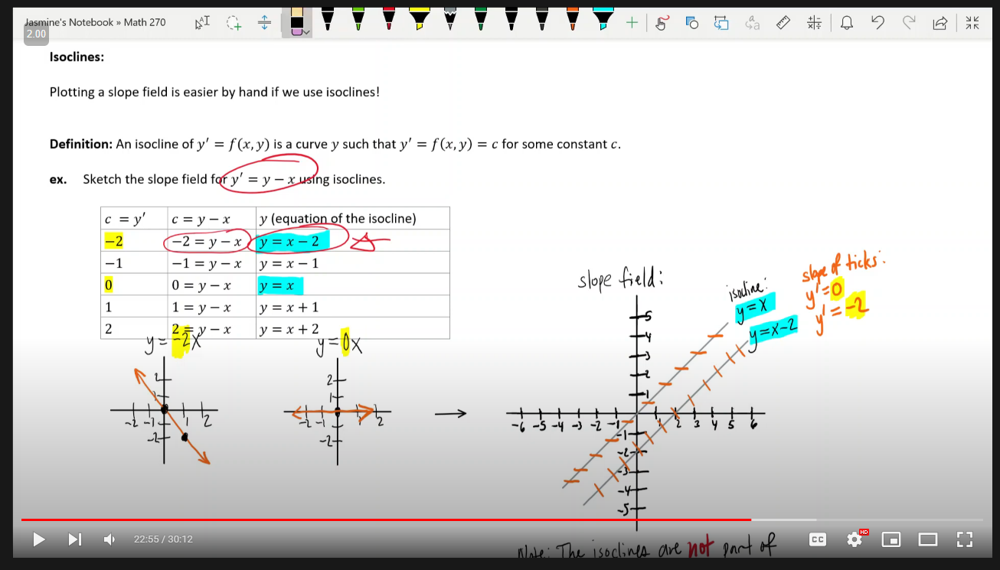

# 1.1
- **differential equation** is an equation that contains one or more derivatives (ODE, partial, etc.)
- **order** is the highest order derivate
- to wrote a diff-eq that describes a situtaion look for keywords: `rate of change`, `proportional`, etc. Ex: The time rate of chanf of the velocity v of a coasting motorboat is proportional to the square of v. THis would becoime dv/dt = kv^2 (k bc prop, inv-prop would be k/somthing)

# 1.2
- to see if an equation is a solution to the difff-eq simply plug it in. An identity would mean yes.
- there are 2 kinds of solutions
    - general: a family of solutions. No intital condition is given and C is a constant
    - particular: a single solution based off of the intial condition. Here C has been solved for.
- given a ODE we can visualize the solution with `slope fields`
- a solution to an ODE is a function whose slope at each point is specified by the derivative
- ex: dy/dx = x+y
    - given a list of points I have solve for the slope bc of the above equation
- `equilibrium sol`: a sol to a deff-eq that doesn't change over time (to solve, the y'=0 and solve for y)
    - `stable`if sols near it tend toward it as t -> infinity
    - `unstable` if sols near it tend away from it as t -> infinity
    - `semistable` if one side is stable and one side unstable
- `isocline`: 

# 1.3
## `Seperable ODE`
- seperate the x's and y's the integrate and solve. Given an initial value you should get a particular solution
- https://www.emathhelp.net/calculators/differential-equations/differential-equation-calculator/
- **CHECK FOR EQUILIBRIUM SOL**
## PRACTICE THIS SHIT DONT REMEMBER INTEGRALS

# 1.4
## Approximation Methods
### Euler's Method
- https://www.emathhelp.net/calculators/differential-equations/euler-method-calculator/

# 1.5
## Picard's Theorem
- Answers whether or not a IVP have a single, unique solution
- Offers a way to check if a problem has 1 solution
- Steps:
    - if continuous around a point there exists a rectangle R sithat what the existence of picard's theorem will apply
    - if the patrial with respect to y is continuous around a point there is a unique solution
- https://www.youtube.com/watch?v=sZC-F1NgoLg
- finding the rectangle is distance formula + set builder notation

# 2.1
## Linear Equations
- A Linear Diff-eq is of the form A(t)y^n + B(t)y^n-1 + ... = f(t)
    - here n is the degree of the derivative
    - if f(t) = 0, the diff-eq is `homogeneous`
    - ex: cos(t)y' + sin(t)y = 2sin(t); linear, non-homogeneous
    - y'' - t^2y = 0; linear homogeneous

# 2.2
## Solving Linear ODE
- Given dy/dx = P(x)y + Q(x)
    - re-write is as: dy/dx + P(x)y = Q(x)
    - solve for `ρ(x)`. ρ(x) = e^∫P(x)
    - multiply the whole equation by ρ(x)
    - integrate both sides. The left side you can shortcut because it came from a product rule therefore the components are there. One in each term

# **There's a lot of offloading to test day...**

# 3.1
## Matrices Sums and Products
- addition is item wise
- scalar multiplication applys the scalar to each item
- matrix multiplication requires num cols in A == num  rows in B. Multiply each row in A by each column in B summing each product in i's own index. results in a A.row x B.col matrix
    - order matter AB != BA
Ex: 
- `dot produtct` requires transposed shapes. multiply itemwise and sum the products
- `orthogonal` if dot product is zero
- the length or `norm` of a vector , ||v|| is sqrt(v dot v)
- a vector is a  `unit vector` if the norm is 1

# 3.2
- For `underdetermined` systems ,that is a systems whose RREF is missing a pivot column (col with 1 in correct spot), answerr is 3 vectors in terms of s and t
