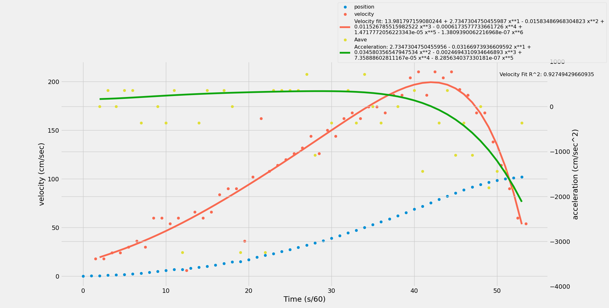

# Lab 3

`Velocity Fit`: -1.3809e-7x6 + 1.4718e-5x5 - 0.0006x4 + 0.0115x3 - 0.0158x2 + 2.7347x + 13.9818

`Derivative` (ae. acceleration): -8.2856e-7x5 + 7.3589e-5x4 - 0.0025x3 + 0.0345x2 - 0.0317x + 2.7347

anorubberband : (g * mh)/(mc + mh) => (980cm/s2 * 300g) / (450g + 300g) = 392cm/s2

aderivative_flat_average : 279cm/s2

`% difference`: 28.8

anorubberband is larger than aderivative_flat_average as it should be because anorubberband is the maximum aderivative_flat_average can be given all other forces are negligible. Possibly, because we didn't take into account friction or the mass of the rubber band our experimental value is much lower than our theoretical value. Other reasons may include the precision of the instruments we measured with. Having us measure with a ruler instead of a piece of equipment that is more precise could have messed with our results and a faster spark thing would also give us clearer data. The rubber band has a meaningful impact on the velocity of the system. aderivative_flat_average is the average slope of the velocity from the interval [2, 30]. aave is unbelievably noisy. From the graph it may look like you'd be able to tell that there's a general downward trend with respect to time but that's because the top part of the graph was truncated. If I only had aderivative_flat_average , it would be very difficult to tell how the acceleration was changing; however, using the derivative of velocity as the acceleration makes it pretty clear that from the time interval [2, 30] the acceleration is pretty constant and only after that does the rubber band start to affect the system.