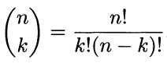

<!-- comes from a book called "All of Statistics a concise course in statistical inference"  -->

# Chapter 1: Probability
## 1.2 Sample Spaces and Events
- All possible outcomes are called a `sample space` ($\Omega$)
- specific outcomes are called `elements` ($\omega$)
- a subset of $\Omega$ is called an `event`
- example: tossing a coin 2 times. $\Omega$ = {H H, HT, T H, TT}. The event that the first toss is heads is A = {H H, HT}

## 1.3 Probability
- if A is an is an event then $P(A)$ is the probability of A.
- P is a `probability distribution`
- to be a probability distribution you must
    - $P(A) \geq 0 \text{ for every event A}$
    - $P(\Omega) = 1$
    - $If A_1, A_2 \text{,... are mutually exclusive then } P(\cup A_i) = \Sigma A_i$
    - that is to say each event has a probability of occurring, the sum of all probabilities is one, and no clue **TODO: ask about this**
## 1.4 Probability on Finite Sample Spaces
- if $\Omega$ is finite and all $A_n$ are equally likely, $P$ is a `uniform probability distribution`
- To compute probabilities, we need to count the number of points in an event A (`combinatorial methods`)
- given n objects the number of ways of ordering said objects is $n!$ and $0! = 1$
- `n choose k` is the number of **DISTINCT** ways of choosing k objects from n

## 1.5 Independent Events
- two events are independent if $P(AB) = P(A) * P(B)$
- therefore => $P(\sqcup A_i) = \coprod P(A_i)$
- more sensibly, the probability of n independent events happen is the product of the probabilities
- Independence is sometimes assumed and sometimes derived
- Disjoint events with positive probability are not independent
## 1.6 Conditional Probability
- 